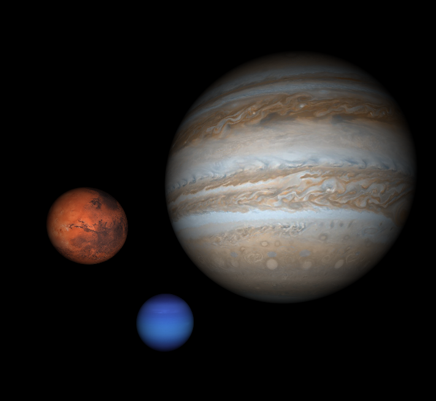

# Distributed Raytracer
An object-oriented, multithreaded, distributed raytracer written in C++.

## Features
* Atomic shapes
  * Sphere
  * Plane
  * Quad
  * Triangle
* Triangle Meshes, including .ply parsing
* Texture Mapping
* Distributed Raytracing
  * Area lights w/ soft shadows
  * Thin lens w/ adjustable aperture
* Multiple Samplers
  * Grid based sampling
  * Jittered-grid based sampling
* Json input parsing
* Bounding cubes
* Multithreading (to be upgraded to tiled approach soon)

## Example images

## Future Work
* Full bounding volume hierarchy
* Global illumination via rendering equation
* Optimizations and bugfixing
